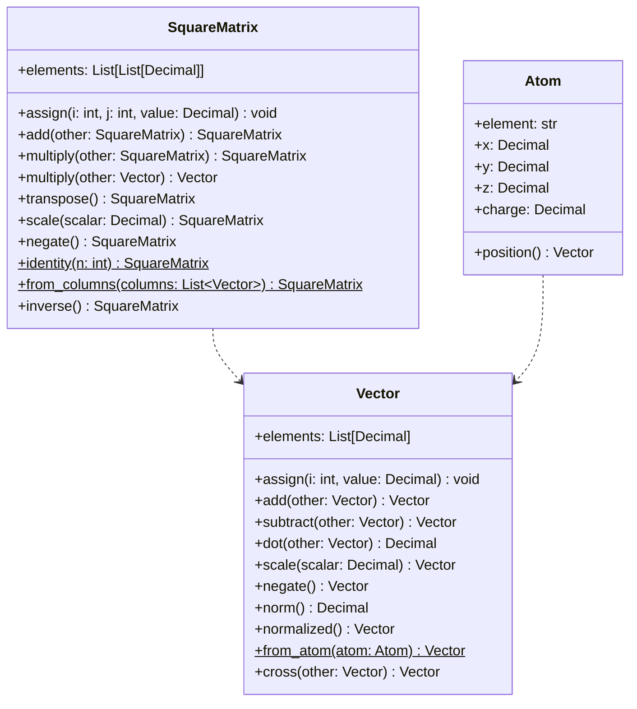

```mermaid
classDiagram

class Atom {
    +element: str
    +x: Decimal
    +y: Decimal
    +z: Decimal
    +charge: Decimal
    +position() Vector
}

class SquareMatrix {
    +elements: List[List[Decimal]]
    +assign(i: int, j: int, value: Decimal) void
    +add(other: SquareMatrix) SquareMatrix
    +multiply(other: SquareMatrix) SquareMatrix
    +multiply(other: Vector) Vector
    +transpose() SquareMatrix
    +scale(scalar: Decimal) SquareMatrix
    +negate() SquareMatrix
    +identity(n: int)$ SquareMatrix
    +from_columns(columns: List~Vector~)$ SquareMatrix
    +inverse() SquareMatrix
}

class Vector {
    +elements: List[Decimal]
    +assign(i: int, value: Decimal) void
    +add(other: Vector) Vector
    +subtract(other: Vector) Vector
    +dot(other: Vector) Decimal
    +scale(scalar: Decimal) Vector
    +negate() Vector
    +norm() Decimal
    +normalized() Vector
    +from_atom(atom: Atom)$ Vector
    +cross(other: Vector) Vector
}

SquareMatrix ..> Vector
Atom ..> Vector
```
