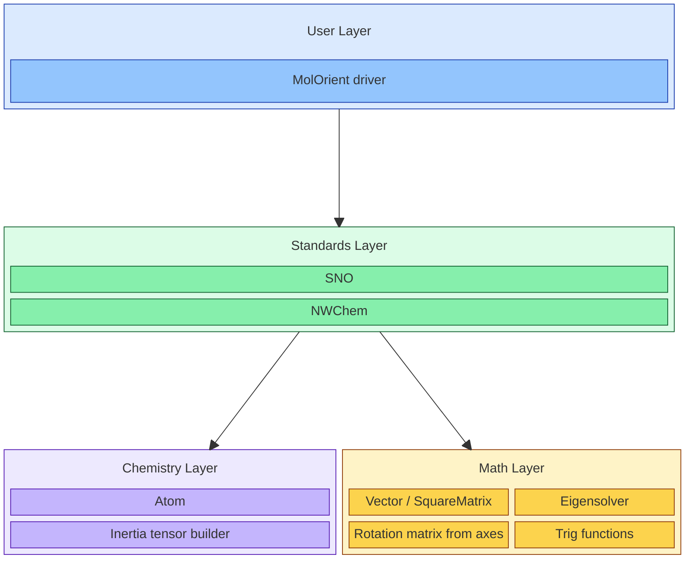

# Design

```mermaid
block-beta
  columns 2

  block:user:2
    columns 1
    userLabel["User Layer"]
    driver["MolOrient driver"]
  end

  space:2

  block:standards:2
    columns 1
    stdLabel["Standards Layer"]
    sno["SNO"]
    nwchem["NWChem"]
  end

  space:2

  block:chemistry
    columns 1
    chemLabel["Chemistry Layer"]
    atom["Atom"]
    inertia["Inertia tensor builder"]
  end

  block:math
    columns 2
    mathLabel["Math Layer"]:2
    linalg["Vector / SquareMatrix"]
    eig["Eigensolver"]
    rotmat["Rotation matrix from axes"]
    trig["Trig functions"]
  end

  user --> standards
  standards --> chemistry
  standards --> math

  style user fill:#dbeafe,stroke:#1e40af
  style userLabel fill:#dbeafe,stroke:none
  style driver fill:#93c5fd,stroke:#1e40af
  style standards fill:#dcfce7,stroke:#166534
  style stdLabel fill:#dcfce7,stroke:none
  style sno fill:#86efac,stroke:#166534
  style nwchem fill:#86efac,stroke:#166534
  style chemistry fill:#ede9fe,stroke:#5b21b6
  style chemLabel fill:#ede9fe,stroke:none
  style atom fill:#c4b5fd,stroke:#5b21b6
  style inertia fill:#c4b5fd,stroke:#5b21b6
  style math fill:#fef3c7,stroke:#92400e
  style mathLabel fill:#fef3c7,stroke:none
  style linalg fill:#fcd34d,stroke:#92400e
  style eig fill:#fcd34d,stroke:#92400e
  style rotmat fill:#fcd34d,stroke:#92400e
  style trig fill:#fcd34d,stroke:#92400e
```
