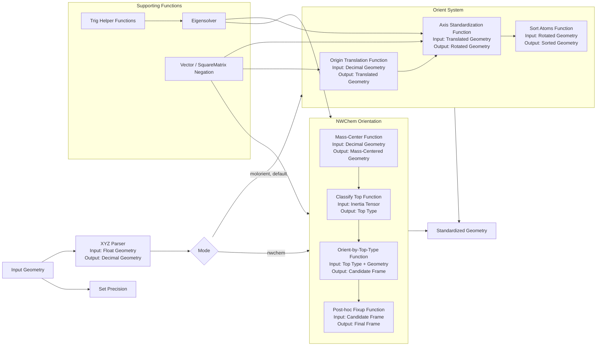

```mermaid
flowchart LR

INPUT[Input Geometry] --> XYZ[XYZ Parser\nInput: Float Geometry\n Output: Decimal Geometry]
INPUT[Input Geometry] --> PREC[Set Precision]

XYZ --> MODE{Mode}
MODE -->|molorient, default| ORIENTSYSTEM[ORIENT SYSTEM]
MODE -->|nwchem| NWCHEM[NWChem Orientation]

ORIENTSYSTEM --> OUTPUT[Standardized Geometry]
NWCHEM --> OUTPUT

subgraph ORIENTSYSTEM[Orient System]
    TRANS[Origin Translation Function\nInput: Decimal Geometry\nOutput: Translated Geometry]
    ROT[Axis Standardization Function\nInput: Translated Geometry\nOutput: Rotated Geometry]
    SORT[Sort Atoms Function\nInput: Rotated Geometry\nOutput: Sorted Geometry]
    TRANS --> ROT --> SORT
end

subgraph NWCHEM[NWChem Orientation]
    MASSCTR[Mass-Center Function\nInput: Decimal Geometry\nOutput: Mass-Centered Geometry]
    CLASSIFY[Classify Top Function\nInput: Inertia Tensor\nOutput: Top Type]
    NWAXES[Orient-by-Top-Type Function\nInput: Top Type + Geometry\nOutput: Candidate Frame]
    POSTFIX[Post-hoc Fixup Function\nInput: Candidate Frame\nOutput: Final Frame]
    MASSCTR --> CLASSIFY --> NWAXES --> POSTFIX
end

subgraph HELPERS[Supporting Functions]
    TRIG[Trig Helper Functions]
    DIAG[Eigensolver]
    NEG[Vector / SquareMatrix Negation]
    TRIG --> DIAG
end

DIAG --> ROT
DIAG --> NWCHEM
NEG --> ROT
NEG --> TRANS
NEG --> NWCHEM
```
